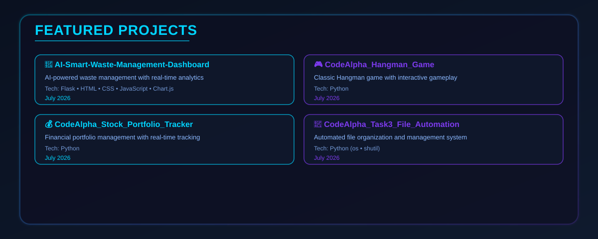
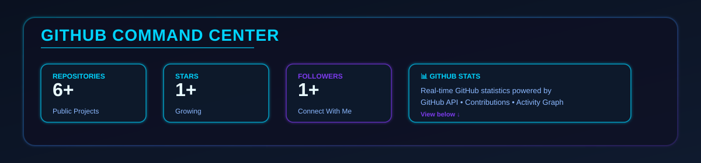
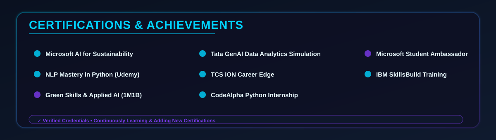
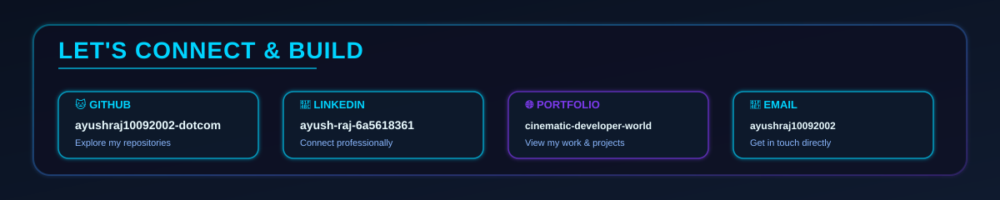

<!-- AYUSH RAJ - PREMIUM CINEMATIC DEVELOPER PORTFOLIO -->
<div align="center">



</div>

---

## 👤 About Me


**Building practical projects while exploring AI, software development and emerging technologies.**

---

## 💻 Tech Stack Dashboard


---

## 💼 Professional Experience


---

## 🎓 Education


---

## 🚀 Featured Projects



### Project Links

1. **AI-Smart-Waste-Management-Dashboard**
   - Repository: [View on GitHub](https://github.com/ayushraj10092002-dotcom/AI-Smart-Waste-Management-Dashboard)
   - Tech: Flask • HTML • CSS • JavaScript • Chart.js

2. **CodeAlpha_Hangman_Game**
   - Repository: [View on GitHub](https://github.com/ayushraj10092002-dotcom/CodeAlpha_Hangman_Game)
   - Tech: Python

3. **CodeAlpha_Stock_Portfolio_Tracker**
   - Repository: [View on GitHub](https://github.com/ayushraj10092002-dotcom/CodeAlpha_Stock_Portfolio_Tracker)
   - Tech: Python

4. **CodeAlpha_Task3_File_Automation**
   - Repository: [View on GitHub](https://github.com/ayushraj10092002-dotcom/CodeAlpha_Task3_File_Automation)
   - Tech: Python (os • shutil)

---

## 📊 GitHub Command Center



### Real-Time GitHub Statistics

<p align="center">
  
</p>

<p align="center">
  
</p>

<p align="center">
  
</p>

---

## 🔥 Contribution Activity

<p align="center">
  
</p>

---

## 🏆 Certifications & Achievements



---

## 🌱 Currently Learning

```
📚 LEARNING ROADMAP

├─ Advanced Python Programming
│  ├─ Decorators & Metaclasses
│  ├─ Concurrency & Async
│  └─ Performance Optimization
│
├─ Data Structures & Algorithms (DSA)
│  ├─ Array & String Algorithms
│  ├─ Tree & Graph Algorithms
│  └─ Dynamic Programming
│
├─ Artificial Intelligence & Machine Learning
│  ├─ Supervised Learning
│  ├─ Unsupervised Learning
│  └─ Neural Networks
│
├─ Generative AI
│  ├─ Large Language Models (LLMs)
│  ├─ Prompt Engineering
│  └─ AI Applications
│
└─ Cloud Computing
   ├─ AWS Basics
   ├─ Infrastructure as Code
   └─ Serverless Architecture
```

---

## 🤝 Let's Connect & Collaborate



### Contact Information

<p align="center">
  <a href="https://github.com/ayushraj10092002-dotcom"></a>
  <a href="https://www.linkedin.com/in/ayush-raj-6a5618361/"></a>
  <a href="https://cinematic-developer-world.lovable.app/"></a>
  <a href="mailto:ayushraj10092002@gmail.com"></a>
</p>

### Open to Opportunities

**Building practical projects while exploring AI, software development and emerging technologies.**

- 🐱 **GitHub:** [ayushraj10092002-dotcom](https://github.com/ayushraj10092002-dotcom)
- 💼 **LinkedIn:** [ayush-raj-6a5618361](https://www.linkedin.com/in/ayush-raj-6a5618361/)
- 🌐 **Portfolio:** [cinematic-developer-world.lovable.app](https://cinematic-developer-world.lovable.app/)
- 📧 **Email:** [ayushraj10092002@gmail.com](mailto:ayushraj10092002@gmail.com)

---

## 💡 Philosophy

<p align="center">
  <em>
    <strong>Code → Learn → Build → Deploy → Repeat</strong><br>
    <strong>Collaborate → Innovate → Explore → Grow</strong>
  </em>
</p>

<p align="center">
  "Every line of code is a step towards mastery.<br>
  Every project is an opportunity to learn.<br>
  Every challenge is a chance to grow."
</p>

---

<p align="center">
  
</p>

<p align="center">
  <strong>Made with ⚡ by Ayush Ram</strong><br>
  <em>Premium Cinematic Developer Portfolio • October 2026</em>
</p>
